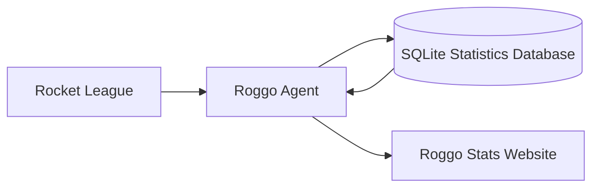

<div align="center">

# Roggo Stats

### Track your matches and analyze your sessions.

Roggo Stats is a Rocket League statistics platform consisting of a lightweight local data collector and a web application for analyzing matches, sessions, and player performance.


</div>

---

## About

Roggo Stats collects Rocket League match data and turns it into readable statistics.

The **Roggo Agent** runs locally in the background while you play. It receives telemetry from Rocket League, processes completed matches, and stores them on your computer.

The **Roggo Stats website** displays the collected data and provides detailed views for matches, sessions, teams, and individual players.

*All match data stays on your device. The website processes it locally in your browser and does not store it on the server.*

## Features

* Automatic Rocket League match collection
* Match history with detailed scoreboards
* Session-based performance analysis
* Win-rate and average-statistics tracking
* Core and advanced player statistics
* Team and opponent comparisons
* Local match storage
* Support for hiding individual matches
* Lightweight Windows background agent

## Statistics

Roggo Stats tracks values such as:

* Wins and losses
* Score
* Goals
* Assists
* Saves
* Shots
* Demolitions
* Boost usage
* Supersonic time
* Ground and wall time
* Powerslide time

## How It Works



1. Rocket League sends match telemetry to the local agent.
2. The agent processes and stores completed matches.
3. The website loads the collected data.
4. Matches and sessions can be analyzed through the web interface.

## Limitations

The collected statistics are based on telemetry generated by the local Rocket League client.

As a result:

* Different clients may report slightly different values for the same match
* Some statistics may be incomplete when packets are lost
* Unusual match endings may not always provide enough information for reliable result classification
* The agent cannot recover telemetry that Rocket League did not export

Roggo Stats treats the collected data as analytical telemetry rather than an authoritative competitive record.

## Installation
The simplest installation is through the installer. The installer configures the agent to start automatically with Windows.

Download and install the latest version of the Roggo Agent from the repository's **Releases** page.

Rocket League must be configured to send telemetry to the agent:

```ini
[TAGame.MatchStatsExporter_TA]
Port=49123
PacketSendRate=120
```

The configured port must match the port selected in Roggo Agent.

## Building from Source

A recent Rust toolchain is required for the agent.

```bash
git clone https://github.com/Fruduruk/Roggo-Stats.git
cd Roggo-Stats
cargo build --release
```

## Project Status

Roggo Stats is under active development.

Features, data formats, and interfaces may change between versions.

## Disclaimer

Roggo Stats is an independent community project and is not affiliated with Psyonix LLC or Epic Games, Inc.

Rocket League and all related trademarks belong to their respective owners.
